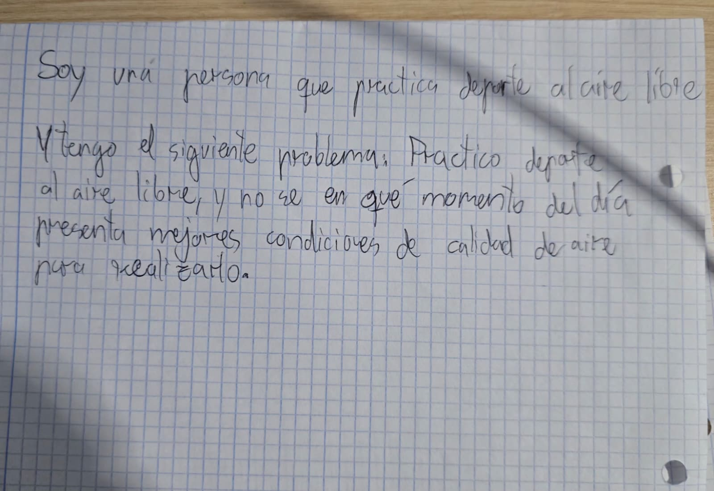
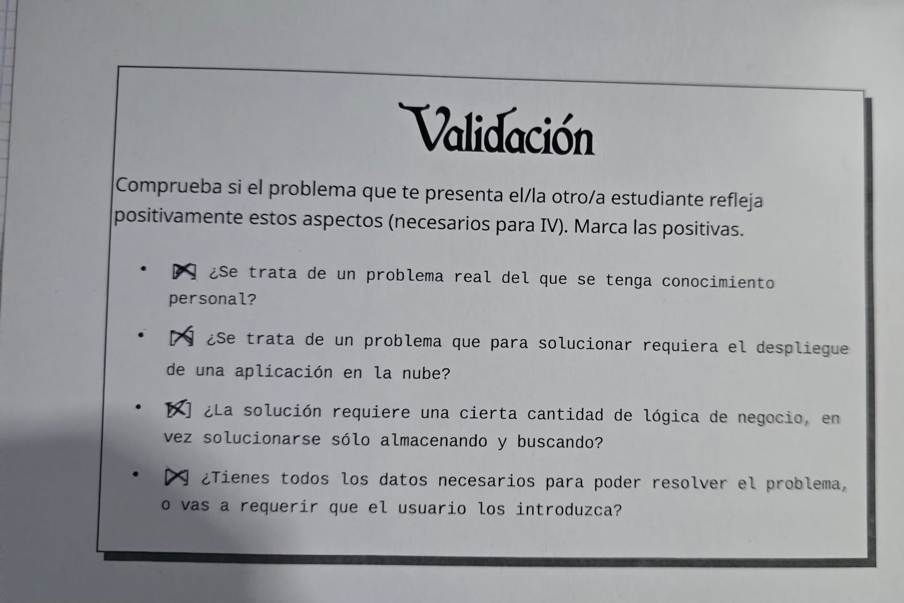

# Calidad Aire Deporte

## Problema

Practico deporte al aire libre en granada, y necesito saber
qué franjas horarias presentan mejores condiciones de calidad del aire
para realizar la actividad.

La calidad del aire puede variar a lo largo del día y las distintas
estaciones de medición registran diferentes concentraciones de
contaminantes. Por ello, elegir una franja horaria u otra puede suponer
realizar la actividad en condiciones de calidad del aire diferentes.

Este problema lo conozco por mi experiencia realizando actividades
deportivas al aire libre, como salir a caminar o a correr.

## Datos ambientales

Para resolver el problema se utilizarán datos reales de calidad del aire
publicados por la Junta de Andalucía:

[Datos históricos de calidad del aire](https://www.juntadeandalucia.es/medioambiente/atmosfera/informes_siva/historico_cuantitativo/)

Los datos se distribuyen en ficheros CSV organizados por año y por
contaminante. Existen ficheros de mediciones horarias con el formato:

`PA_HH_AAAA.csv`

donde `PA` identifica el contaminante y `AAAA` el año de las mediciones.

Los ficheros horarios contienen las siguientes columnas:

- `PROVINCIA`: código de la provincia.
- `MUNICIPIO`: código del municipio.
- `ESTACION`: código de la estación de vigilancia.
- `PARAMETRO`: código del contaminante medido.
- `TECNICA`: código de la técnica de medición.
- `AÑO`: año de la medición.
- `MES`: mes de la medición.
- `DIA`: día de la medición.
- `H01`: `H24`: valores registrados durante las 24 horas del día.

Por ejemplo, el fichero `C6H6_HH_2020.csv` contiene mediciones horarias
reales y registros correspondientes a la provincia de Granada.

Los códigos de provincia, municipio y estación se interpretan mediante
el fichero `Listado_estaciones.xlsx`, mientras que los códigos de los
parámetros y de las técnicas de medición se interpretan mediante los
ficheros `Listado_parametros.xlsx` y `Listado_tecnicas_de_medida.xlsx`.

Para el problema se utilizarán las mediciones horarias de los
contaminantes disponibles en las estaciones seleccionadas de Granada.

## Qué se necesita analizar

Se analizarán las mediciones horarias de calidad del aire de las
estaciones seleccionadas de Granada.

El objetivo será comparar las diferentes franjas horarias utilizando los valores registrados 
de los contaminantes y establecer cuáles presentan mejores condiciones de calidad del aire para 
realizar actividad deportiva.

## Documentación

configuración [configuracion del repositorio](docs/configuracion.md)

## Juego de rol

## Tarjeta Validacion

## Configuración

La configuración inicial del proyecto se realizará mediante las herramientas y servicios necesarios para su desarrollo y posterior despliegue en la nube.
